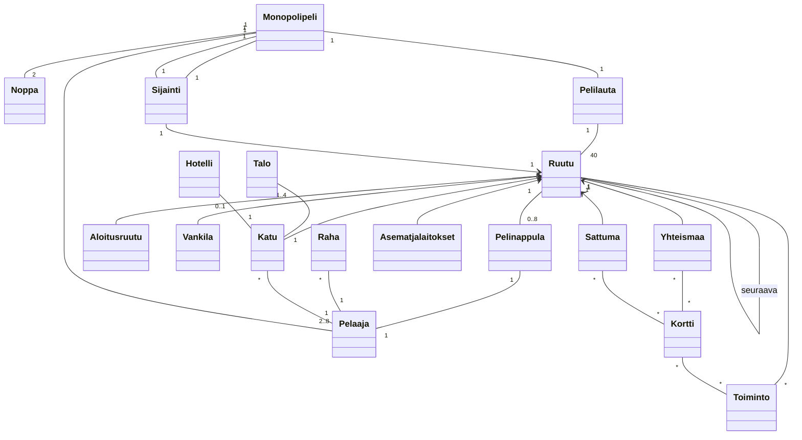

```mermaid
 classDiagram
    Monopolipeli "1" -- "2" Noppa
    Monopolipeli "1" -- "1" Pelilauta
    %% Sijainti kuuluu mielestäni pelilaudalle, mutta tein tehtävänannon mukaan
    Monopolipeli "1" -- "1" Sijainti 
    Monopolipeli "1" -- "1" Sijainti
    Pelilauta "1" -- "40" Ruutu
    Sijainti "1" --> "1" Ruutu
    Ruutu "1" -- "1" Ruutu : seuraava
    Ruutu "1" -- "0..8" Pelinappula
    Pelinappula "1" -- "1" Pelaaja
    Pelaaja "2..8" -- "1" Monopolipeli
    Ruutu <-- Aloitusruutu
    Ruutu <-- Vankila
    Ruutu <-- Sattuma
    Ruutu <-- Yhteismaa
    Ruutu <-- Asemat ja laitokset
    Ruutu <-- Katu
    Ruutu "1" -- "*" Toiminto
    Yhteismaa "*" -- "*" Kortti
    Sattuma "*" -- "*" Kortti
    Kortti "*" -- "*" Toiminto
    Raha "*" -- "1" Pelaaja
    Katu "*" -- "1" Pelaaja
    Talo "1..4" -- "1" Katu
    Hotelli "0..1" -- "1" Katu
    
```